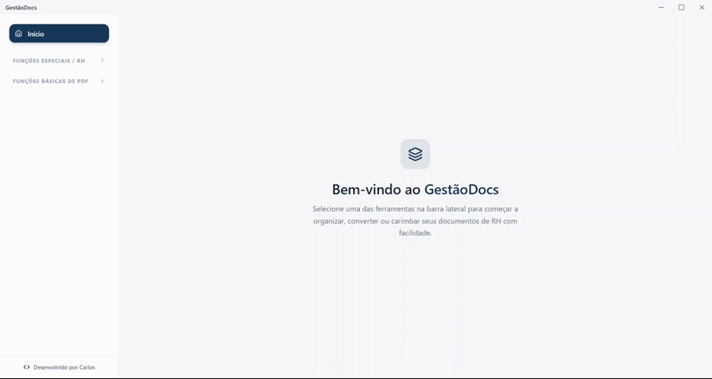

# GestãoDocs

Aplicativo desktop para organização e processamento de documentos de RH e arquivos PDF. O projeto combina uma interface em React/Vite com o runtime nativo do Tauri, permitindo trabalhar com arquivos locais de forma prática.



## Recursos

- Separação de termos de rescisão (TRCT) e apólices de seguro a partir de PDFs consolidados.
- Leitura de extratos analíticos do FGTS em TXT e geração de PDFs individuais.
- Aplicação de carimbos em arquivos PDF.
- Conversão de documentos DOC para PDF.
- Organização visual de páginas de PDF: reordenação, rotação, remoção e exportação.
- Extração de texto com suporte a OCR quando necessário.

## Tecnologias

- [React](https://react.dev/) e [Vite](https://vite.dev/)
- [Tauri 2](https://v2.tauri.app/)
- `pdf-lib`, `pdfjs-dist` e `jsPDF` para manipulação de PDFs
- `@dnd-kit` para ordenação de páginas por arrastar e soltar

## Pré-requisitos

- Node.js 18 ou superior
- Rust (toolchain estável), necessário para executar o Tauri
- Dependências de desenvolvimento do Tauri para o seu sistema operacional

## Como executar

```bash
npm install
npm run dev
```

O comando abre o aplicativo Tauri em modo de desenvolvimento. Para gerar uma versão de produção:

```bash
npm run build
```

Para executar somente a interface no navegador, use `npm run dev:vite`. Algumas operações de arquivos dependem do ambiente Tauri e não estarão disponíveis no navegador.

## Estrutura do projeto

```text
src/          Interface React e lógica de processamento
src-tauri/    Código Rust, comandos nativos e configuração do Tauri
```

## Scripts

| Comando | Descrição |
| --- | --- |
| `npm run dev` | Inicia o aplicativo Tauri em desenvolvimento. |
| `npm run dev:vite` | Inicia apenas o servidor Vite. |
| `npm run build` | Cria o pacote de produção do Tauri. |
| `npm run build:vite` | Gera somente os arquivos estáticos da interface. |

## Licença

Este projeto está licenciado sob a [Licença MIT](LICENSE).
